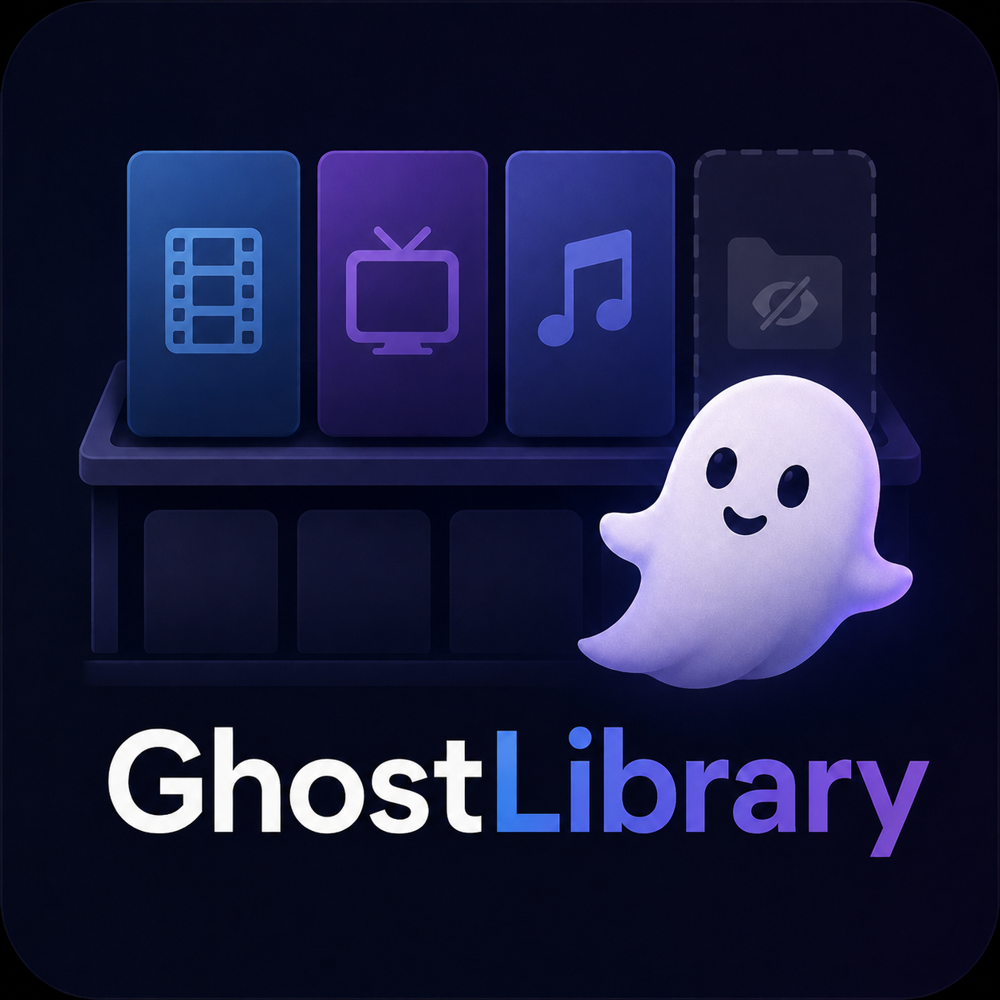

<div align="center">
  
  <h1>GhostLibrary</h1>

  [](https://github.com/upchui/Jellyfin-GhostLibrary/actions/workflows/build.yml)
  [](https://github.com/upchui/Jellyfin-GhostLibrary/actions/workflows/release.yml)
  [](https://github.com/upchui/Jellyfin-GhostLibrary/releases/latest)
  [](https://jellyfin.org)

  <p>A <a href="https://jellyfin.org">Jellyfin</a> server plugin that hides selected media libraries from clients — without blocking access for other plugins or the filesystem.</p>
</div>

## Why?

Jellyfin's built-in way to restrict a library is through user policies, which also blocks filesystem access. This breaks plugins like **Cinema Mode** that rely on direct library access.

GhostLibrary intercepts API responses before they reach the client and silently removes the configured libraries. Internally, everything keeps working as normal.

## Features

| Feature | Description |
|---------|-------------|
| **Hidden mode** | Library tile and all its content are removed from every API response |
| **Stealth mode** | Library tile is kept but shown as empty (`ChildCount = 0`); content is hidden |
| **Content filtering** | Items from hidden/stealth libraries are also removed from Latest, Continue Watching, Next Up, and Similar rows |
| **Admin bypass** | Administrators always see all libraries (configurable) |
| **Master switch** | Pause all filtering without losing any settings |
| **Schedule rules** | Per-library rules combining date range, day-of-week, and daily time window (all ANDed) |
| **Client filter** | Restrict filtering to specific clients by User-Agent substring |
| **Sub-folder hiding** | Hide individual folders within an otherwise visible library |
| **Activity log** | Real-time log of every filter event — what was removed, when, and for which client |
| **Configurable retention** | Set how many log entries to keep in memory (10 – 10 000) |
| **Webhook** | HTTP POST notification on every config save — useful for Home Assistant |
| **Export / Import** | Download and restore the full configuration as JSON |

**What it does NOT touch:**
- `ILibraryManager` — Cinema Mode and other server-side plugins still see every library
- File system access — paths and permissions are unchanged
- User policies — no database modifications

## Installation

### Via Plugin Repository (recommended)

1. Open the Jellyfin dashboard
2. Go to **Plugins → Repositories**
3. Click **+** and add this URL:
   ```
   https://raw.githubusercontent.com/upchui/Jellyfin-GhostLibrary/main/manifest.json
   ```
4. Go to **Plugins → Catalog**, find **GhostLibrary** and install it
5. Restart Jellyfin

### Manual

1. Download the latest `GhostLibrary_x.x.x.x.zip` from [Releases](https://github.com/upchui/Jellyfin-GhostLibrary/releases)
2. Extract `Jellyfin.Plugin.GhostLibrary.dll` into your Jellyfin plugins directory:
   ```
   # Linux
   ~/.config/jellyfin/plugins/GhostLibrary_x.x.x.x/

   # Windows
   %AppData%\Jellyfin\plugins\GhostLibrary_x.x.x.x\
   ```
3. Restart Jellyfin

## Configuration

1. Go to **Dashboard → Plugins → GhostLibrary**
2. Click a library card to cycle through its mode: **Visible → Hidden → Stealth**
3. Click **Save**

### Library modes

- **Visible** — no filtering, shown normally to all clients
- **Hidden** — library tile and all its content are removed from every client response
- **Stealth** — tile stays but shows 0 items; content is filtered from aggregated rows

### Schedule (optional)

Per-library rules for when hiding is active. All conditions are ANDed — leave everything blank to hide at all times.

| Field | Description |
|-------|-------------|
| **Date Range** | First and last calendar date the rule applies. Leave *Until* empty for permanent access. |
| **Weekly Schedule** | Which days of the week the rule is active. No days selected = every day. |
| **Daily Time Window** | Time-of-day window (e.g. 22:00 – 06:00). Overnight spans are supported. Leave blank = all day. |

### Client Filter (optional)

Enter comma-separated User-Agent substrings (e.g. `AndroidTV, Infuse`). When set, only those clients are filtered — all others see every library.

### Activity Log

Switch to the **Activity Log** tab to see a live, auto-refreshing table of filter events. Each row shows the timestamp, API path, client User-Agent, and how many items were removed.

> **Android TV / first use:** After saving, clear the Jellyfin app cache once so the app discards its old cached library list.

## How It Works

GhostLibrary registers a global ASP.NET Core `IAsyncActionFilter` via `PostConfigure<MvcOptions>`. After every controller action it checks whether the response is a `QueryResult<BaseItemDto>`. If so:

1. **CollectionFolder** items matching hidden IDs are removed; stealth IDs have their `ChildCount` set to 0.
2. **Content items** (movies, episodes, etc.) are checked against their library via `ILibraryManager.GetCollectionFolders()` — the authoritative API for mapping any item to its top-level library.
3. **Schedule rules** are evaluated against the current time of day before building the hidden ID set.
4. The `ETag` response header is replaced with a SHA-256 hash of the filtered result to prevent stale 304 responses.
5. Conditional GET headers (`If-None-Match`, `If-Modified-Since`) are stripped from `/Views` requests before execution to prevent 304 bypass.

Endpoints that must always pass through unfiltered (e.g. `/Intros`) are explicitly bypassed before any processing.

## REST API

The plugin exposes two admin-only endpoints (requires `RequiresElevation` policy):

| Method | Path | Description |
|--------|------|-------------|
| `GET` | `/GhostLibrary/Log` | Returns the last N filter events (newest first) |
| `DELETE` | `/GhostLibrary/Log` | Clears the in-memory log |

## Build from Source

No local .NET SDK required — Docker handles the build:

```bash
git clone https://github.com/upchui/Jellyfin-GhostLibrary.git
cd Jellyfin-GhostLibrary

docker build -f Dockerfile.build --output type=local,dest=./dist .
# Built DLL lands in ./dist/
```

## Compatibility

| Jellyfin | Plugin | .NET |
|----------|--------|------|
| 10.9.x   | 1.x    | 8.0  |

## License

MIT
